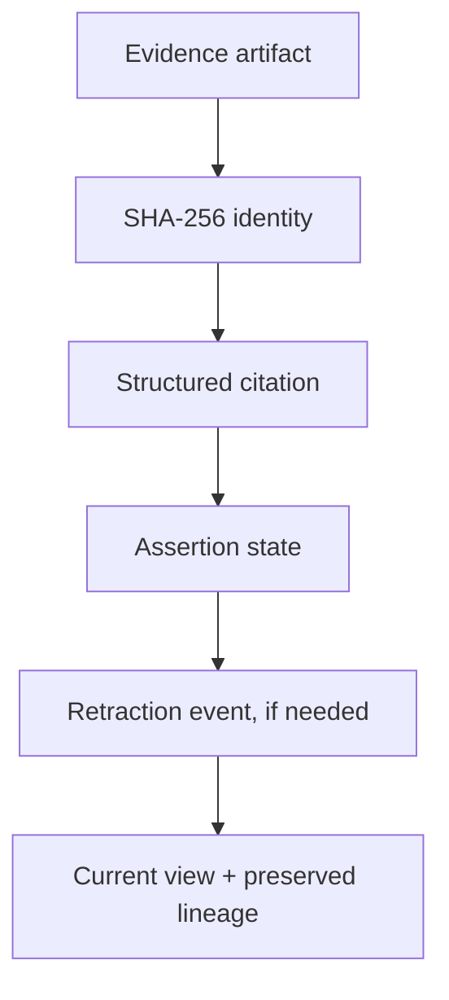

# Evidence Lineage Reference

A small, independent reference implementation for a simple discipline: **preserve what an assertion is based on, distinguish uncertainty from absence, and never erase a correction.**

It is a portfolio demonstration by [Jonathan R. Santana](https://github.com/SustainShujaa). The example uses only synthetic evidence and deliberately avoids private product names, data, and methodology.

## What it demonstrates



The reference records a source artifact, attaches a structured citation to a bounded assertion, verifies that later bytes still match the recorded digest, and records any retraction as an event rather than deleting the original assertion.

## Run it

Requires Node.js 20 or later.

```bash
npm test
npm run demo
```

## Design boundaries

- A digest identifies a specific byte sequence; it does not prove authorship, custody history, or semantic support.
- A citation locator identifies where a reviewer should look; it does not prove that the locator is true or that the assertion is valid.
- `UNKNOWN` is a valid state. Missing evidence must not be silently converted into a positive or negative conclusion.
- Retraction changes the current disposition while retaining the historical assertion and its cited evidence.

See [architecture notes](docs/architecture.md) and [the disclosure ledger](docs/disclosure-ledger.md) for the scope and publication controls.
